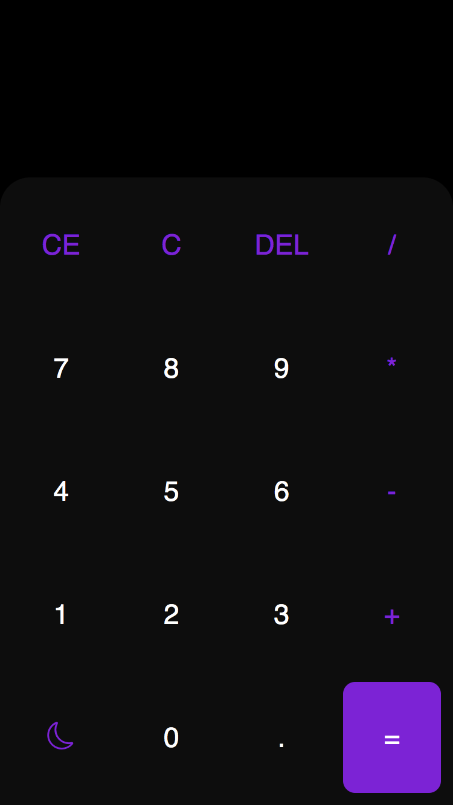

<h2 style="text-align:center"> CALCULADORA 🔢 </h2>

<br>
<br>


> Preview



<br>

### 📝 Sobre:
- Projeto feito com Java script. Uma calculadora com as 4 principais operações matemátias (adição, subtração, multiplicação e divisão).
- Opção de tema escuro e claro.

### ⚙️ Tecnologias:
- JavaScript
- HTML
- CSS

### Clone do repositório:

- Instale GIT no seu sistema <a href="https://git-scm.com/downloads">AQUI</a>

```bash
$ git config --global user.name "seu nome"
```

```bash
$ git config --global user.email seuemail@example.com
```

```bash
$ git clone https://https://github.com/paulopariz/CALCULADORA.git
```

### 📱 Contato:


  <a href = "https://mail.google.com/mail/u/0/?fs=1&tf=cm&source=mailto&to=paulopariz01@gmail.com"></a>  <a href="https://www.instagram.com/parizpaulo_/" target="_blank"></a>

 


